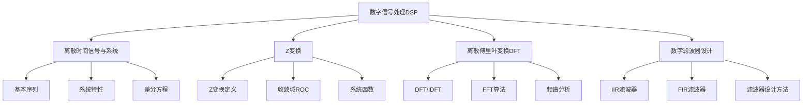
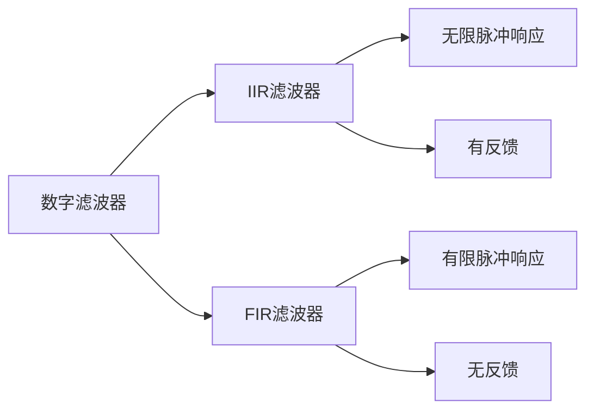
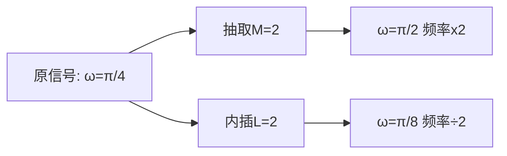
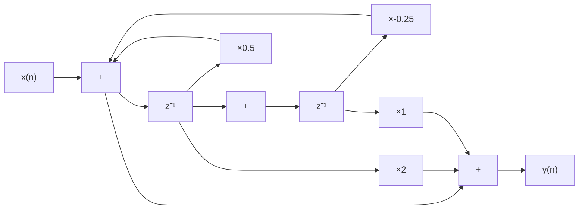
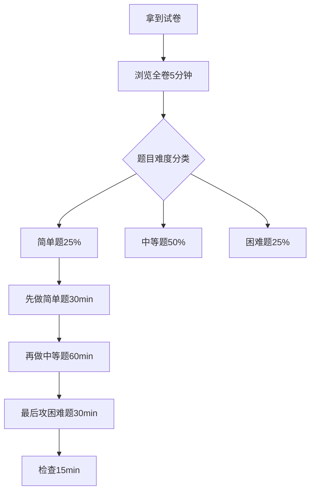

# 数字信号处理(DSP)考前冲刺复习指南

> **考试时间**: 12月31日  
> **复习时间**: 2天  
> **适用对象**: 零基础学习者

---

## 📚 目录

1. [核心知识体系](#核心知识体系)
2. [65分复习提纲(及格线)](#65分复习提纲)
3. [75分复习提纲(良好)](#75分复习提纲)
4. [85分复习提纲(优秀)](#85分复习提纲)
5. [练习题与详解](#练习题与详解)

---

## 核心知识体系

---

## 65分复习提纲

### 📌 目标：掌握基础概念，完成基本计算

### 第一天上午 (3小时)

#### 1. 离散时间信号基础

**必须掌握的基本序列：**

1. **单位脉冲序列** $\delta[n]$:
   $$\delta[n] = \begin{cases} 1, & n=0 \\ 0, & n\neq 0 \end{cases}$$

2. **单位阶跃序列** $u[n]$:
   $$u[n] = \begin{cases} 1, & n\geq 0 \\ 0, & n< 0 \end{cases}$$

3. **指数序列**: $x[n] = a^n u[n]$

4. **正弦序列**: $x[n] = A\sin(\omega n + \phi)$

**序列运算：**
- 移位：$x[n-n_0]$ (右移$n_0$位)
- 翻转：$x[-n]$
- 相加：$x_1[n] + x_2[n]$
- 相乘：$x_1[n] \cdot x_2[n]$

#### 2. 离散时间系统

**线性时不变(LTI)系统的关键特性：**

1. **线性**: $T\{ax_1[n] + bx_2[n]\} = aT\{x_1[n]\} + bT\{x_2[n]\}$

2. **时不变**: 若 $x[n] \rightarrow y[n]$，则 $x[n-n_0] \rightarrow y[n-n_0]$

3. **因果性**: 输出只依赖于当前和过去的输入

4. **稳定性**: 有界输入产生有界输出(BIBO)
   $$\sum_{k=-\infty}^{\infty}|h[k]| < \infty$$

**卷积和**:
$$y[n] = x[n] * h[n] = \sum_{k=-\infty}^{\infty}x[k]h[n-k]$$

### 第一天下午 (3小时)

#### 3. Z变换基础

**定义**:
$$X(z) = \sum_{n=-\infty}^{\infty}x[n]z^{-n}$$

**常用序列的Z变换：**

| 序列 $x[n]$ | Z变换 $X(z)$ | 收敛域ROC |
|------------|-------------|----------|
| $\delta[n]$ | $1$ | 全z平面 |
| $u[n]$ | $\frac{1}{1-z^{-1}}$ | $\|z\|>1$ |
| $a^n u[n]$ | $\frac{1}{1-az^{-1}}$ | $\|z\|>|a|$ |
| $-a^n u[-n-1]$ | $\frac{1}{1-az^{-1}}$ | $\|z\|<|a|$ |

**Z变换性质：**
- 线性: $ax_1[n]+bx_2[n] \leftrightarrow aX_1(z)+bX_2(z)$
- 时移: $x[n-n_0] \leftrightarrow z^{-n_0}X(z)$
- 卷积: $x[n]*h[n] \leftrightarrow X(z)H(z)$

**系统函数**:
$$H(z) = \frac{Y(z)}{X(z)} = \frac{\sum_{k=0}^{M}b_k z^{-k}}{\sum_{k=0}^{N}a_k z^{-k}}$$

### 第二天上午 (3小时)

#### 4. 离散傅里叶变换(DFT)

**DFT定义**:
$$X[k] = \sum_{n=0}^{N-1}x[n]e^{-j\frac{2\pi}{N}kn}, \quad k=0,1,...,N-1$$

**IDFT(逆变换)**:
$$x[n] = \frac{1}{N}\sum_{k=0}^{N-1}X[k]e^{j\frac{2\pi}{N}kn}, \quad n=0,1,...,N-1$$

**旋转因子**:
$$W_N = e^{-j\frac{2\pi}{N}}$$

则DFT可写为：
$$X[k] = \sum_{n=0}^{N-1}x[n]W_N^{kn}$$

**DFT性质：**
- 周期性: $X[k+N] = X[k]$
- 线性: $DFT\{ax_1[n]+bx_2[n]\} = aX_1[k]+bX_2[k]$
- 圆周移位: $x[(n-m) \mod N] \leftrightarrow X[k]W_N^{km}$

### 第二天下午 (3小时)

#### 5. 数字滤波器基础

**滤波器分类：**

**IIR滤波器：**
- 差分方程: $y[n] = \sum_{k=0}^{M}b_k x[n-k] - \sum_{k=1}^{N}a_k y[n-k]$
- 优点: 阶数低，效率高
- 缺点: 相位非线性

**FIR滤波器：**
- 差分方程: $y[n] = \sum_{k=0}^{M}b_k x[n-k]$
- 优点: 线性相位，稳定
- 缺点: 阶数高

---

## 75分复习提纲

### 📌 目标：在65分基础上，深化理解，掌握计算技巧

### 额外知识点 (第一天晚上2小时)

#### 6. 系统的频率响应

**频率响应定义**:
$$H(e^{j\omega}) = H(z)|_{z=e^{j\omega}}$$

**幅频特性**: $|H(e^{j\omega})|$  
**相频特性**: $\angle H(e^{j\omega})$

**与系统函数的关系**:
$$H(z) = \frac{B(z)}{A(z)} = K\frac{\prod_{i=1}^{M}(1-c_iz^{-1})}{\prod_{i=1}^{N}(1-d_iz^{-1})}$$

零点: $c_i$ (使$H(z)=0$)  
极点: $d_i$ (使$H(z)=\infty$)

**零极点与频率响应**:
$$|H(e^{j\omega})| = K\frac{\prod_{i=1}^{M}|e^{j\omega}-c_i|}{\prod_{i=1}^{N}|e^{j\omega}-d_i|}$$

#### 7. 系统稳定性判定

**方法1: 极点位置**
- 所有极点在单位圆内 → 稳定
- 有极点在单位圆外 → 不稳定

**方法2: 冲激响应**
$$\sum_{n=0}^{\infty}|h[n]| < \infty$$

#### 8. FFT快速算法

**基本思想**: 将N点DFT分解为两个N/2点DFT

**时间抽取(DIT) FFT流程**:

**计算复杂度**:
- 直接DFT: $O(N^2)$
- FFT: $O(N\log_2 N)$

**蝶形运算单元**:
$$X[k] = X_1[k] + W_N^k X_2[k]$$
$$X[k+N/2] = X_1[k] - W_N^k X_2[k]$$

### 额外知识点 (第二天晚上2小时)

#### 9. FIR滤波器设计

**窗函数法：**

1. **理想滤波器**: $h_d[n]$ (无限长)
2. **加窗截断**: $h[n] = h_d[n] \cdot w[n]$

**常用窗函数：**

- **矩形窗**: $w[n] = 1, \quad 0\leq n\leq N-1$
  
- **汉宁窗**: $w[n] = 0.5 - 0.5\cos\frac{2\pi n}{N-1}$
  
- **海明窗**: $w[n] = 0.54 - 0.46\cos\frac{2\pi n}{N-1}$

**线性相位条件**:
$$h[n] = \pm h[N-1-n]$$

#### 10. IIR滤波器设计

**冲激响应不变法**:
$$h[n] = h_a(nT)$$

其中$h_a(t)$是模拟滤波器的冲激响应，$T$是采样周期。

**双线性变换法**:
$$s = \frac{2}{T}\frac{1-z^{-1}}{1+z^{-1}}$$

将模拟滤波器$H_a(s)$变换为数字滤波器$H(z)$。

---

## 85分复习提纲

### 📌 目标：全面掌握，融会贯通，解决复杂问题

### 高级主题 (分散在两天的学习间隙)

#### 11. 离散时间傅里叶变换(DTFT)

**定义**:
$$X(e^{j\omega}) = \sum_{n=-\infty}^{\infty}x[n]e^{-j\omega n}$$

**逆变换**:
$$x[n] = \frac{1}{2\pi}\int_{-\pi}^{\pi}X(e^{j\omega})e^{j\omega n}d\omega$$

**DTFT与DFT关系**:
$$X[k] = X(e^{j\omega})|_{\omega=\frac{2\pi k}{N}}$$

DFT是DTFT在频域的采样。

#### 12. 采样定理

**奈奎斯特采样定理**:
$$f_s \geq 2f_{max}$$

其中$f_s$是采样频率，$f_{max}$是信号最高频率。

**频域关系**:
$$X_s(e^{j\omega}) = \frac{1}{T}\sum_{k=-\infty}^{\infty}X_a(j\frac{\omega-2\pi k}{T})$$

#### 13. 多速率信号处理

**抽取(Decimation)**:
$$y[n] = x[Mn]$$

抽取因子为$M$，采样率降低$M$倍。

**内插(Interpolation)**:
$$y[n] = \begin{cases} x[n/L], & n=0,\pm L,\pm 2L,... \\ 0, & \text{其他} \end{cases}$$

内插因子为$L$，采样率提高$L$倍。

#### 14. 有限字长效应

**量化误差**:
$$e_q[n] = x_q[n] - x[n]$$

**舍入**: $-\frac{\Delta}{2} \leq e_q[n] < \frac{\Delta}{2}$

**截断**: $-\Delta < e_q[n] \leq 0$

其中$\Delta$是量化步长。

#### 15. 高级滤波器结构

**IIR滤波器结构：**
- 直接型(I型、II型)
- 级联型
- 并联型

**FIR滤波器结构：**
- 直接型
- 级联型
- 线性相位结构

#### 16. 滤波器设计指标

**技术指标：**
- 通带截止频率: $\omega_p$
- 阻带截止频率: $\omega_s$
- 通带最大衰减: $\delta_1$ 或 $A_p$ (dB)
- 阻带最小衰减: $\delta_2$ 或 $A_s$ (dB)

**巴特沃斯滤波器**: 最平坦幅频特性  
**切比雪夫滤波器**: 通带或阻带等波纹  
**椭圆滤波器**: 通带和阻带都等波纹

---

## 练习题与详解

### 65分级别练习题

#### 题目1: 基本序列运算

**题目**: 已知序列 $x[n] = \delta[n] + 2\delta[n-1] + \delta[n-2]$，求：
1. $x[n-1]$
2. $x[-n]$
3. $x[2n]$

**解析**:

1. **求 $x[n-1]$** (右移1位):
   $$x[n-1] = \delta[n-1] + 2\delta[n-2] + \delta[n-3]$$

2. **求 $x[-n]$** (时间翻转):
   $$x[-n] = \delta[-n] + 2\delta[-n+1] + \delta[-n+2]$$
   即:
   $$x[-n] = \delta[n] + 2\delta[n+1] + \delta[n+2]$$

3. **求 $x[2n]$** (时间压缩):
   只保留偶数点:
   $$x[2n] = \delta[2n] + 2\delta[2n-1] + \delta[2n-2]$$
   
   当$n=0$: $x[0] = \delta[0] + 2\delta[-1] + \delta[-2] = 1$  
   当$n=1$: $x[2] = \delta[2] + 2\delta[1] + \delta[0] = 1$  
   
   所以: $x[2n] = \delta[n] + \delta[n-1]$

---

#### 题目2: 卷积计算

**题目**: 计算 $x[n] = \{1, 2, 3\}$ (从$n=0$开始) 与 $h[n] = \{1, 1\}$ (从$n=0$开始) 的卷积。

**解析**:

使用列表法:

$$y[n] = x[n] * h[n] = \sum_{k=-\infty}^{\infty}x[k]h[n-k]$$

| n | k=0 | k=1 | k=2 | y[n] |
|---|-----|-----|-----|------|
| 0 | 1×1 | - | - | 1 |
| 1 | 2×1 | 1×1 | - | 3 |
| 2 | 3×1 | 2×1 | - | 5 |
| 3 | - | 3×1 | - | 3 |

**答案**: $y[n] = \{1, 3, 5, 3\}$ (从$n=0$到$n=3$)

**验证**: 序列长度 = len(x) + len(h) - 1 = 3 + 2 - 1 = 4 ✓

---

#### 题目3: Z变换计算

**题目**: 求序列 $x[n] = (0.5)^n u[n]$ 的Z变换及收敛域。

**解析**:

使用公式: $a^n u[n] \leftrightarrow \frac{1}{1-az^{-1}}, \quad |z|>|a|$

这里 $a = 0.5$，所以:

$$X(z) = \frac{1}{1-0.5z^{-1}} = \frac{z}{z-0.5}$$

**收敛域**: $|z| > 0.5$

**物理意义**: 
- 有一个零点在 $z=0$
- 有一个极点在 $z=0.5$ (在单位圆内，系统稳定)

---

#### 题目4: 系统稳定性判断

**题目**: 判断系统 $H(z) = \frac{1}{1-0.8z^{-1}}$, ROC: $|z|>0.8$ 是否稳定和因果。

**解析**:

1. **找极点**:
   令分母为0: $1-0.8z^{-1} = 0$  
   得: $z = 0.8$

2. **稳定性判断**:
   极点位置: $|0.8| = 0.8 < 1$ (在单位圆内)  
   **结论**: 系统稳定 ✓

3. **因果性判断**:
   ROC是 $|z|>0.8$，是一个向外扩展的区域，包含$|z|=\infty$  
   **结论**: 系统因果 ✓

---

#### 题目5: DFT计算

**题目**: 计算序列 $x[n] = \{1, 1, 0, 0\}$ 的4点DFT。

**解析**:

$$X[k] = \sum_{n=0}^{3}x[n]W_4^{kn}, \quad W_4 = e^{-j\frac{\pi}{2}}$$

**计算 $W_4$ 的幂次**:
- $W_4^0 = 1$
- $W_4^1 = e^{-j\pi/2} = -j$
- $W_4^2 = e^{-j\pi} = -1$
- $W_4^3 = e^{-j3\pi/2} = j$

**逐个计算**:

$k=0$:
$$X[0] = 1 \cdot 1 + 1 \cdot 1 + 0 + 0 = 2$$

$k=1$:
$$X[1] = 1 \cdot 1 + 1 \cdot (-j) + 0 + 0 = 1 - j$$

$k=2$:
$$X[2] = 1 \cdot 1 + 1 \cdot (-1) + 0 + 0 = 0$$

$k=3$:
$$X[3] = 1 \cdot 1 + 1 \cdot j + 0 + 0 = 1 + j$$

**答案**: $X[k] = \{2, 1-j, 0, 1+j\}$

---

### 75分级别练习题

#### 题目6: 频率响应分析

**题目**: 已知系统函数 $H(z) = \frac{1-z^{-2}}{1-0.9z^{-1}}$，求:
1. 零点和极点
2. 频率响应表达式
3. 在 $\omega = 0$ 和 $\omega = \pi$ 处的幅度响应

**解析**:

1. **零极点**:
   - 零点: $1-z^{-2} = 0 \Rightarrow z^2 = 1 \Rightarrow z = \pm 1$
   - 极点: $1-0.9z^{-1} = 0 \Rightarrow z = 0.9$

2. **频率响应**:
   $$H(e^{j\omega}) = \frac{1-e^{-j2\omega}}{1-0.9e^{-j\omega}}$$

3. **幅度响应计算**:
   
   在 $\omega = 0$:
   $$H(e^{j0}) = \frac{1-1}{1-0.9} = \frac{0}{0.1} = 0$$
   
   在 $\omega = \pi$:
   $$H(e^{j\pi}) = \frac{1-e^{-j2\pi}}{1-0.9e^{-j\pi}} = \frac{1-1}{1+0.9} = 0$$

**结论**: 这是一个带阻滤波器，在$\omega=0$和$\omega=\pi$处响应为0。

---

#### 题目7: 系统函数求解

**题目**: 已知差分方程 $y[n] - 0.5y[n-1] = x[n] + 2x[n-1]$，求:
1. 系统函数 $H(z)$
2. 单位脉冲响应 $h[n]$

**解析**:

1. **求系统函数**:
   
   对差分方程两边取Z变换:
   $$Y(z) - 0.5z^{-1}Y(z) = X(z) + 2z^{-1}X(z)$$
   
   $$Y(z)(1 - 0.5z^{-1}) = X(z)(1 + 2z^{-1})$$
   
   $$H(z) = \frac{Y(z)}{X(z)} = \frac{1 + 2z^{-1}}{1 - 0.5z^{-1}}$$

2. **求单位脉冲响应**:
   
   使用部分分式展开或长除法。这里用长除法:
   
   $$H(z) = \frac{1 + 2z^{-1}}{1 - 0.5z^{-1}}$$
   
   展开为级数:
   $$H(z) = 1 + 2.5z^{-1} + 1.25z^{-2} + 0.625z^{-3} + ...$$
   
   或者利用 $\frac{1}{1-0.5z^{-1}} = \sum_{n=0}^{\infty}(0.5)^n z^{-n}$:
   
   $$H(z) = (1+2z^{-1})\sum_{n=0}^{\infty}(0.5)^n z^{-n}$$
   
   因此:
   $$h[n] = (0.5)^n u[n] + 2(0.5)^{n-1}u[n-1]$$
   $$h[n] = (0.5)^n u[n] + 4(0.5)^n u[n-1]$$
   
   简化:
   - $h[0] = 1$
   - $h[n] = 5(0.5)^n, \quad n \geq 1$

---

#### 题目8: FFT计算量分析

**题目**: 
1. 计算1024点DFT和FFT的乘法次数
2. 说明FFT的优势

**解析**:

1. **DFT乘法次数**:
   
   每个$X[k]$需要$N$次复数乘法  
   共有$N$个$X[k]$  
   总乘法次数: $N^2 = 1024^2 = 1,048,576$次

2. **FFT乘法次数**:
   
   复杂度: $\frac{N}{2}\log_2 N$  
   计算: $\frac{1024}{2}\log_2 1024 = 512 \times 10 = 5,120$次

3. **加速比**:
   $$\frac{1,048,576}{5,120} \approx 205$$
   
   **FFT快约205倍！**

---

#### 题目9: 窗函数设计FIR滤波器

**题目**: 设计一个理想低通滤波器，截止频率$\omega_c = \pi/4$，使用5点矩形窗。

**解析**:

1. **理想低通滤波器**:
   $$h_d[n] = \frac{\sin(\omega_c n)}{\pi n} = \frac{\sin(\pi n/4)}{\pi n}$$

2. **对称化** (使滤波器因果):
   取$N=5$，对称中心在$n=2$:
   $$h_d[n-2] = \frac{\sin[\pi(n-2)/4]}{\pi(n-2)}$$

3. **各点计算**:
   - $n=0$: $h_d[-2] = \frac{\sin(-\pi/2)}{-2\pi} = \frac{1}{2\pi}$
   - $n=1$: $h_d[-1] = \frac{\sin(-\pi/4)}{-\pi} = \frac{\sqrt{2}}{2\pi}$
   - $n=2$: $h_d[0] = \frac{\sin(0)}{0} = \frac{1}{4}$ (洛必达法则)
   - $n=3$: $h_d[1] = \frac{\sin(\pi/4)}{\pi} = \frac{\sqrt{2}}{2\pi}$
   - $n=4$: $h_d[2] = \frac{\sin(\pi/2)}{2\pi} = \frac{1}{2\pi}$

4. **矩形窗** ($w[n]=1$ for $n=0,1,2,3,4$):
   $$h[n] = h_d[n-2] \cdot w[n] = h_d[n-2]$$

**答案**:
$$h[n] = \left\{\frac{1}{2\pi}, \frac{\sqrt{2}}{2\pi}, \frac{1}{4}, \frac{\sqrt{2}}{2\pi}, \frac{1}{2\pi}\right\}$$

---

#### 题目10: 双线性变换

**题目**: 模拟滤波器 $H_a(s) = \frac{1}{s+1}$，采样周期$T=1$s，用双线性变换法转换为数字滤波器。

**解析**:

双线性变换公式:
$$s = \frac{2}{T}\frac{1-z^{-1}}{1+z^{-1}} = 2\frac{1-z^{-1}}{1+z^{-1}}$$

代入:
$$H(z) = H_a(s)|_{s=2\frac{1-z^{-1}}{1+z^{-1}}} = \frac{1}{2\frac{1-z^{-1}}{1+z^{-1}}+1}$$

$$= \frac{1+z^{-1}}{2(1-z^{-1}) + (1+z^{-1})} = \frac{1+z^{-1}}{3-z^{-1}}$$

化简:
$$H(z) = \frac{1}{3}\cdot\frac{1+z^{-1}}{1-\frac{1}{3}z^{-1}}$$

**答案**: $H(z) = \frac{1}{3}\cdot\frac{1+z^{-1}}{1-\frac{1}{3}z^{-1}}$

**差分方程**:
$$y[n] = \frac{1}{3}y[n-1] + \frac{1}{3}x[n] + \frac{1}{3}x[n-1]$$

---

### 85分级别练习题

#### 题目11: DTFT与DFT关系

**题目**: 已知序列 $x[n] = \delta[n] + 0.5\delta[n-1]$
1. 求DTFT $X(e^{j\omega})$
2. 求4点DFT $X[k]$
3. 说明两者关系

**解析**:

1. **求DTFT**:
   $$X(e^{j\omega}) = \sum_{n=-\infty}^{\infty}x[n]e^{-j\omega n}$$
   $$= 1 \cdot e^{0} + 0.5 \cdot e^{-j\omega}$$
   $$= 1 + 0.5e^{-j\omega}$$

2. **求4点DFT**:
   需要周期延拓: $x[n] = \{\underbrace{1, 0.5}_{\text{原序列}}, \underbrace{0, 0}_{\text{补零}}\}$
   
   $$X[k] = \sum_{n=0}^{3}x[n]W_4^{kn}$$
   
   - $X[0] = 1 + 0.5 = 1.5$
   - $X[1] = 1 + 0.5W_4^1 = 1 + 0.5(-j) = 1 - 0.5j$
   - $X[2] = 1 + 0.5W_4^2 = 1 + 0.5(-1) = 0.5$
   - $X[3] = 1 + 0.5W_4^3 = 1 + 0.5(j) = 1 + 0.5j$

3. **关系验证**:
   $$X[k] = X(e^{j\omega})|_{\omega=\frac{2\pi k}{4}} = X(e^{j\frac{\pi k}{2}})$$
   
   验证 $k=0$:
   $$X(e^{j0}) = 1 + 0.5 = 1.5 = X[0]$$ ✓

---

#### 题目12: 采样与混叠

**题目**: 模拟信号 $x_a(t) = \cos(2\pi \cdot 1000t) + \cos(2\pi \cdot 3000t)$
1. 确定奈奎斯特采样率
2. 若采样率为 $f_s = 2500$ Hz，分析混叠现象
3. 计算混叠后的频率

**解析**:

1. **奈奎斯特采样率**:
   最高频率: $f_{max} = 3000$ Hz
   奈奎斯特率: $f_s \geq 2f_{max} = 6000$ Hz

2. **混叠分析**:
   实际采样率: $f_s = 2500$ Hz < 6000 Hz
   **会产生混叠！**

3. **混叠频率计算**:
   
   对于 $f_1 = 1000$ Hz:
   $$f_1' = |f_1 - k \cdot f_s|$$
   取 $k=0$: $f_1' = 1000$ Hz (在Nyquist区间内)
   
   对于 $f_2 = 3000$ Hz:
   $$f_2' = |3000 - 1 \times 2500| = 500 \text{ Hz}$$
   
   **采样后信号**:
   $$x[n] = \cos(2\pi \cdot \frac{1000}{2500}n) + \cos(2\pi \cdot \frac{500}{2500}n)$$
   $$= \cos(0.8\pi n) + \cos(0.4\pi n)$$

**结论**: 3000 Hz 分量混叠到 500 Hz。

---

#### 题目13: 多速率信号处理

**题目**: 序列 $x[n] = \cos(\frac{\pi}{4}n)$，进行以下操作:
1. 2倍抽取得到 $y_1[n]$
2. 2倍内插得到 $y_2[n]$
3. 分析频率变化

**解析**:

1. **2倍抽取** ($M=2$):
   $$y_1[n] = x[2n] = \cos(\frac{\pi}{4} \cdot 2n) = \cos(\frac{\pi}{2}n)$$
   
   **频率变化**: $\omega_0 = \frac{\pi}{4} \rightarrow \omega_1 = \frac{\pi}{2}$ (频率加倍)

2. **2倍内插** ($L=2$):
   $$y_2[n] = \begin{cases} x[n/2] = \cos(\frac{\pi}{8}n), & n \text{ 偶数} \\ 0, & n \text{ 奇数} \end{cases}$$
   
   内插后需要低通滤波器平滑。
   
   **频率变化**: $\omega_0 = \frac{\pi}{4} \rightarrow \omega_2 = \frac{\pi}{8}$ (频率减半)

3. **频谱图**:

---

#### 题目14: 量化效应分析

**题目**: 信号范围 $[-1, 1]$，使用3位二进制量化:
1. 计算量化步长
2. 计算信号量化噪声比(SQNR)
3. 分析舍入和截断的差异

**解析**:

1. **量化步长**:
   3位二进制: $2^3 = 8$ 个量化级
   信号范围: $1-(-1) = 2$
   $$\Delta = \frac{2}{8} = 0.25$$

2. **信号量化噪声比(SQNR)**:
   
   假设信号功率: $P_s = \frac{A^2}{2}$ (A为幅度)
   量化噪声功率(舍入): $P_q = \frac{\Delta^2}{12}$
   
   $$SQNR = 10\log_{10}\frac{P_s}{P_q} \approx 6.02b + 1.76 \text{ dB}$$
   
   其中 $b=3$ 位:
   $$SQNR \approx 6.02 \times 3 + 1.76 = 19.82 \text{ dB}$$

3. **舍入 vs 截断**:
   
   **舍入**:
   - 误差范围: $-\frac{\Delta}{2} \leq e_q < \frac{\Delta}{2}$
   - 均值: $E[e_q] = 0$ (无偏)
   
   **截断**:
   - 误差范围: $-\Delta < e_q \leq 0$
   - 均值: $E[e_q] = -\frac{\Delta}{2}$ (有偏)

---

#### 题目15: IIR滤波器结构

**题目**: 系统函数 $H(z) = \frac{1+2z^{-1}+z^{-2}}{1-0.5z^{-1}+0.25z^{-2}}$
1. 画出直接II型结构
2. 分解为级联型
3. 分析零极点

**解析**:

1. **直接II型结构**:

2. **级联型分解**:
   
   分子: $1+2z^{-1}+z^{-2} = (1+z^{-1})^2$
   分母: $1-0.5z^{-1}+0.25z^{-2}$
   
   求分母零点:
   $$z^2 - 0.5z + 0.25 = 0$$
   $$z = \frac{0.5 \pm \sqrt{0.25-1}}{2} = \frac{0.5 \pm j\frac{\sqrt{3}}{2}}{2} = 0.25 \pm j0.433$$
   
   极点: $z_{p1,2} = 0.5e^{\pm j\pi/3}$ (共轭极点)
   
   级联形式:
   $$H(z) = \frac{1+z^{-1}}{1-z_{p1}z^{-1}} \cdot \frac{1+z^{-1}}{1-z_{p2}z^{-1}}$$

3. **零极点分析**:
   - 零点: $z=-1$ (二重零点，在单位圆上)
   - 极点: $|z_p| = 0.5 < 1$ (在单位圆内，系统稳定)
   - 这是一个低通滤波器(零点在$z=-1$，对应$\omega=\pi$)

---

#### 题目16: 综合设计题

**题目**: 设计一个FIR带通滤波器，要求:
- 通带: $0.3\pi \leq \omega \leq 0.7\pi$
- 过渡带宽: $\Delta\omega = 0.1\pi$
- 阻带衰减: 至少40dB
- 使用汉明窗

求所需的滤波器阶数和设计步骤。

**解析**:

1. **选择窗函数**:
   汉明窗参数:
   - 阻带衰减: $A_s = 53$ dB > 40 dB ✓
   - 过渡带宽: $\Delta\omega = \frac{6.6\pi}{N}$

2. **确定阶数**:
   $$N = \frac{6.6\pi}{\Delta\omega} = \frac{6.6\pi}{0.1\pi} = 66$$
   
   取奇数: $N = 67$

3. **理想带通滤波器**:
   $$h_d[n] = \frac{\sin(0.7\pi n)}{\pi n} - \frac{\sin(0.3\pi n)}{\pi n}$$

4. **对称化** (中心在 $\alpha = \frac{N-1}{2} = 33$):
   $$h_d[n-33], \quad n=0,1,...,66$$

5. **汉明窗**:
   $$w[n] = 0.54 - 0.46\cos\frac{2\pi n}{66}$$

6. **最终滤波器**:
   $$h[n] = h_d[n-33] \cdot w[n]$$

7. **验证线性相位**:
   $$h[n] = h[66-n]$$ (第I类线性相位)

---

## 考试策略与时间分配

### 两天复习计划

#### Day 1 (12月29日)

| 时间段 | 内容 | 目标分数 |
|-------|------|---------|
| 08:00-11:00 | 基础序列、系统特性、卷积 | 65分 |
| 11:00-12:00 | 练习题1-2 | 65分 |
| 14:00-17:00 | Z变换、DFT | 65分 |
| 17:00-18:00 | 练习题3-5 | 65分 |
| 19:00-21:00 | 频率响应、稳定性、FFT | 75分 |
| 21:00-22:00 | 练习题6-8 | 75分 |

#### Day 2 (12月30日)

| 时间段 | 内容 | 目标分数 |
|-------|------|---------|
| 08:00-11:00 | FIR/IIR滤波器设计 | 75分 |
| 11:00-12:00 | 练习题9-10 | 75分 |
| 14:00-16:00 | DTFT、采样定理、多速率 | 85分 |
| 16:00-17:00 | 练习题11-13 | 85分 |
| 19:00-21:00 | 量化、滤波器结构、综合题 | 85分 |
| 21:00-22:00 | 练习题14-16 | 85分 |

### 考试答题技巧

### 各分数段重点

**65分 (及格线)**:
- ✓ 基本序列运算
- ✓ 简单卷积计算
- ✓ Z变换查表
- ✓ DFT直接计算
- ✓ 稳定性判断

**75分 (良好)**:
- ✓ 65分所有内容
- ✓ 频率响应计算
- ✓ 系统函数求解
- ✓ FFT原理
- ✓ 窗函数设计

**85分 (优秀)**:
- ✓ 75分所有内容
- ✓ DTFT分析
- ✓ 采样定理应用
- ✓ 多速率处理
- ✓ 综合设计题

---

## 常用公式速查表

### 基本变换对

| 时域 | 频域(DTFT) | Z域 |
|------|-----------|-----|
| $\delta[n]$ | $1$ | $1$ |
| $u[n]$ | $\frac{1}{1-e^{-j\omega}} + \pi\sum_{k=-\infty}^{\infty}\delta(\omega-2\pi k)$ | $\frac{1}{1-z^{-1}}$ |
| $a^n u[n]$ | $\frac{1}{1-ae^{-j\omega}}$ | $\frac{1}{1-az^{-1}}$ |
| $na^n u[n]$ | - | $\frac{az^{-1}}{(1-az^{-1})^2}$ |

### DFT性质

| 性质 | 时域 | 频域 |
|------|------|------|
| 线性 | $ax_1[n]+bx_2[n]$ | $aX_1[k]+bX_2[k]$ |
| 圆周移位 | $x[(n-m)\mod N]$ | $W_N^{km}X[k]$ |
| 圆周卷积 | $x_1[n] \circledast x_2[n]$ | $X_1[k]X_2[k]$ |
| Parseval定理 | $\sum_{n=0}^{N-1}|x[n]|^2$ | $\frac{1}{N}\sum_{k=0}^{N-1}|X[k]|^2$ |

### 窗函数参数

| 窗函数 | 主瓣宽度 | 旁瓣衰减(dB) | 过渡带宽 |
|--------|---------|-------------|---------|
| 矩形窗 | $4\pi/N$ | 13 | $0.9\pi/N$ |
| 汉宁窗 | $8\pi/N$ | 31 | $3.1\pi/N$ |
| 汉明窗 | $8\pi/N$ | 41 | $3.3\pi/N$ |
| 布莱克曼窗 | $12\pi/N$ | 57 | $5.5\pi/N$ |

### 滤波器设计公式

**巴特沃斯滤波器阶数**:
$$N \geq \frac{\log[(10^{0.1A_s}-1)/(10^{0.1A_p}-1)]}{2\log(\omega_s/\omega_p)}$$

**切比雪夫滤波器阶数**:
$$N \geq \frac{\cosh^{-1}\sqrt{(10^{0.1A_s}-1)/(10^{0.1A_p}-1)}}{\cosh^{-1}(\omega_s/\omega_p)}$$

---

## 考前最后检查清单

### 公式记忆检查

- [ ] DFT/IDFT定义式
- [ ] Z变换常用对
- [ ] 卷积定义
- [ ] 稳定性条件
- [ ] 双线性变换公式

### 计算能力检查

- [ ] 复数运算 ($e^{j\theta} = \cos\theta + j\sin\theta$)
- [ ] 级数求和
- [ ] 部分分式展开
- [ ] 多项式因式分解

### 概念理解检查

- [ ] 因果性 vs 稳定性
- [ ] FIR vs IIR
- [ ] DFT vs DTFT vs Z变换
- [ ] 时域采样 vs 频域采样

---

## 附录：推荐记忆口诀

**Z变换收敛域**:
- 右边序列，圆外收敛
- 左边序列，圆内收敛
- 双边序列，环形收敛

**系统判定**:
- 极点圆内，系统稳定
- 极点圆外，发散不稳
- ROC包含单位圆，系统稳定

**滤波器类型**:
- 零点单位圆上，对应频率被抑制
- 极点单位圆内，对应频率被增强
- 零点在$z=1$，直流被阻
- 零点在$z=-1$，高频被阻

---

## 最后的话

**时间紧迫的学习策略**:

1. **优先级排序**: 65分内容 → 75分内容 → 85分内容
2. **公式理解**: 不要死记硬背，理解推导过程
3. **多做练习**: 每个知识点至少做2-3道题
4. **查漏补缺**: 用练习题检验掌握程度
5. **保持信心**: 2天时间足够掌握核心内容

**考试当天建议**:
- 提前15分钟到场，调整心态
- 先做会做的，再攻难题
- 计算仔细，检查单位和符号
- 时间分配：简单题30%，中等题50%，难题20%

**祝你考试顺利！加油！** 🎓

---

*本复习指南涵盖DSP核心知识点，配有详细例题和解析。建议配合教材和课堂笔记使用。*